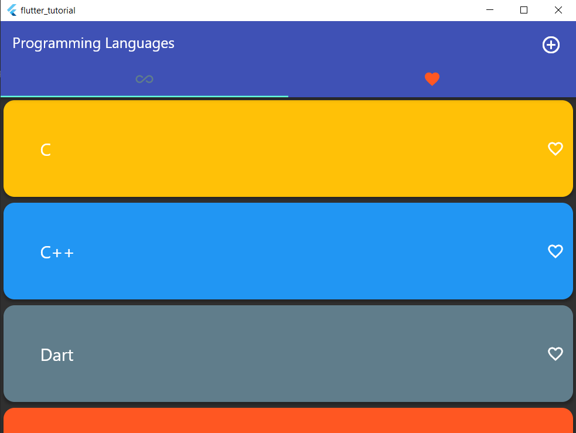
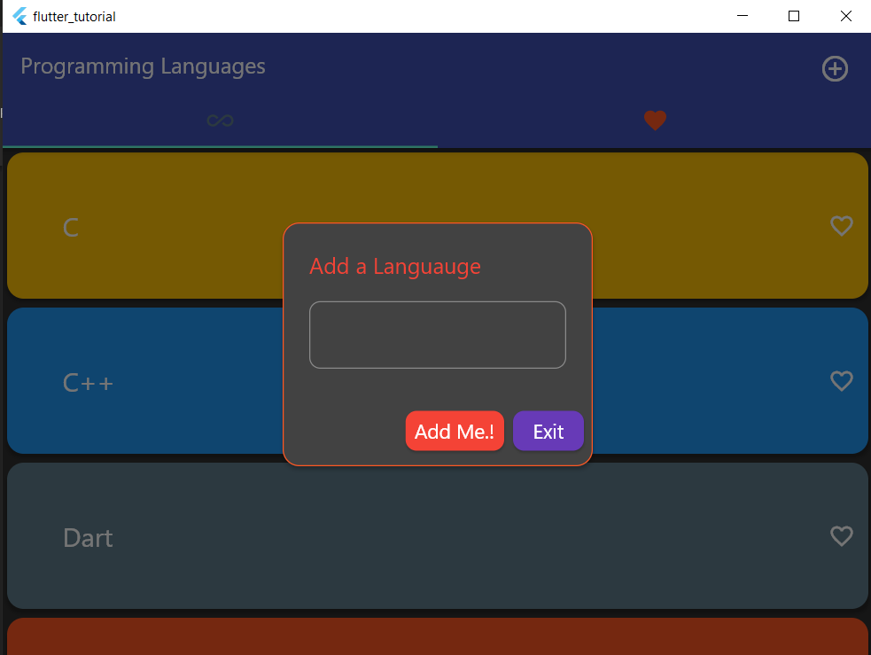
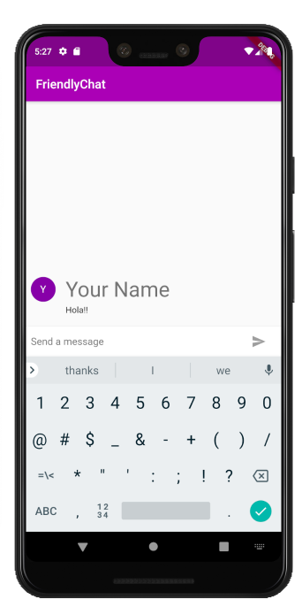

# Flutter
## Introduction to Flutter
* https://flutter.dev/
## Dart Programming
* http://dart.dev/
## Language Tour
* https://dart.dev/guides/language/language-tour
## Getting Started with flutter
* https://flutter.dev/docs/get-started/install
## UI components – Widgets
* Flutter Basic Widgets: https://flutter.dev/docs/development/ui/widgets/basics
##	First Flutter App:
* https://flutter.dev/docs/get-started/codelab  

## flutter_tutorial

A Flutter project to train students on Cross Platform App Development

Here's the link to <a href="http://web-demo-flutter.surge.sh/#/">Web Application</a> of this flutter project.

## Screenshots

### Mobile
 | 

### Web
 | 

### Windows
 | 

## Getting Started

For everything related to flutter, visit https://flutter.dev/

A few resources to get you started in Flutter:

- [Lab: Write your first Flutter app](https://flutter.dev/docs/get-started/codelab)
- [Cookbook: Useful Flutter samples](https://flutter.dev/docs/cookbook)

### To run this project on your machine

Clone the repo in your machine and navigate to root of flutter_tutorial in command line.  
<b>Android</b>:

* `flutter build apk --release`
* `flutter install apk`

To run the second command you should have a device connected to your machine with USB debugging enabled.

<b>Web</b>:

* `flutter channel beta`
* `flutter build web`
* `flutter run`

This will run the web application on your localhost.

<b>Desktop</b>

* `flutter channel master`
* `flutter config --enable-macos-desktop`
* `flutter run -d macos`

Replace macOS with Windows, in case you are using Windows. Run `flutter doctor` for required installations.

## Assignment
* 