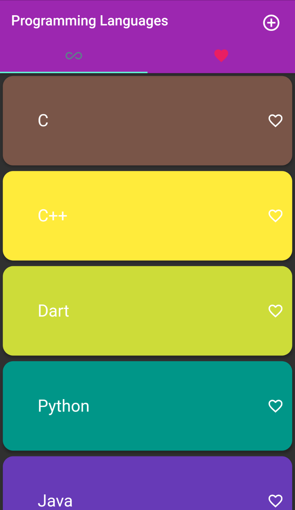
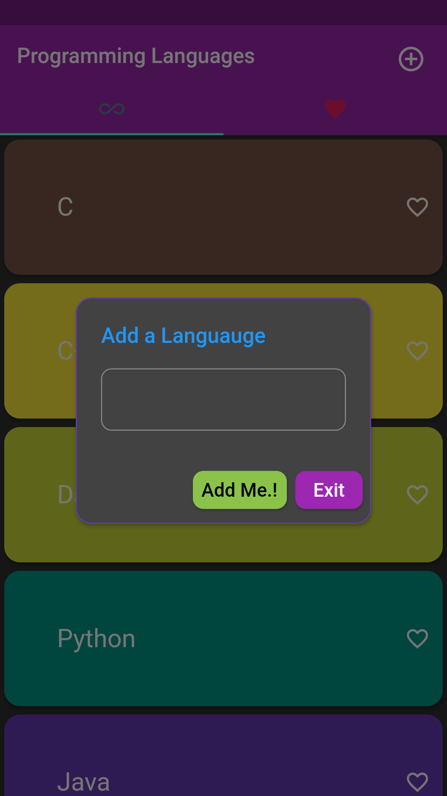
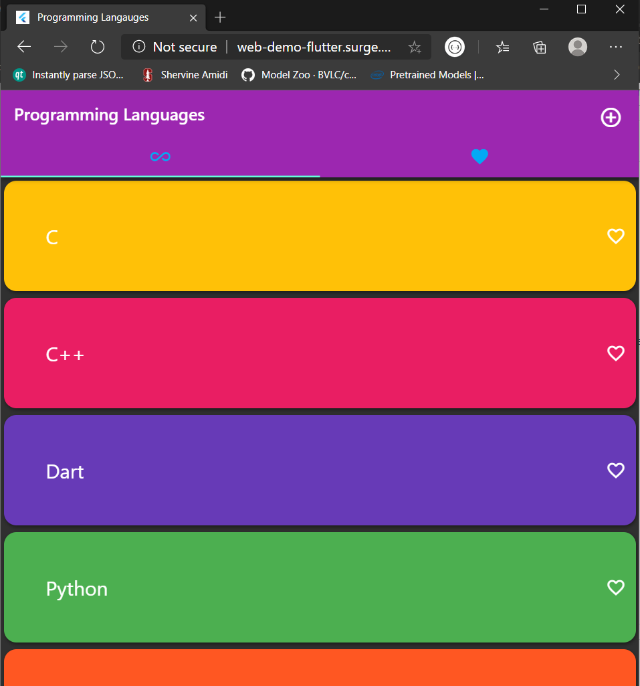
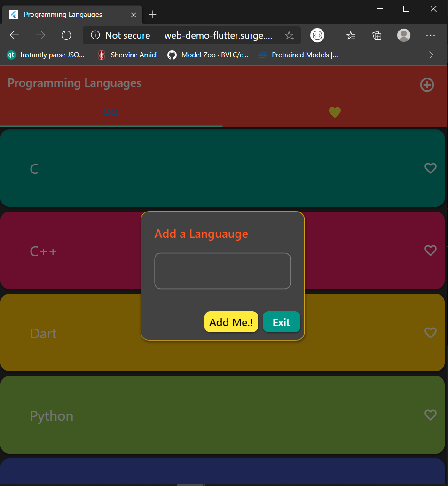

# flutter_tutorial

A Flutter project to train students on Cross Platform App Development

## Screenshots

### Mobile
 | 

### Web
 | 

## Getting Started

A few resources to get you started in Flutter:

- [Lab: Write your first Flutter app](https://flutter.dev/docs/get-started/codelab)
- [Cookbook: Useful Flutter samples](https://flutter.dev/docs/cookbook)

Refer to [online documentation](https://flutter.dev/docs) for more details.
